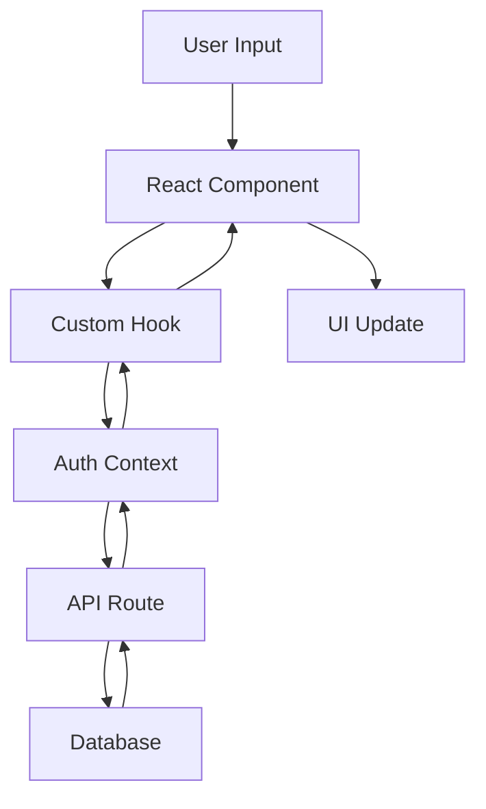

# Codebase Structure

## Overview

LTH-Game is a Next.js-based educational supply chain management game built with TypeScript, featuring custom authentication, real-time game mechanics, and comprehensive accessibility support.

## Architecture Decision

**Framework**: Next.js 15.4.6 with App Router  
**Language**: TypeScript for type safety and developer experience  
**Database**: PostgreSQL with custom SQL queries (no ORM by choice)  
**Styling**: Tailwind CSS with Radix UI components  
**Authentication**: Custom session-based auth (not NextAuth)  
**State Management**: React Context + custom hooks  

### Why These Choices?

- **Next.js App Router**: Modern routing, server components, and full-stack capabilities
- **Custom Authentication**: Full control over security, session management, and user flows
- **Direct SQL**: Performance optimization and explicit database control
- **Tailwind + Radix**: Rapid UI development with accessibility built-in
- **TypeScript**: Compile-time error prevention and better IDE support

## Folder Structure

```
LTH-Game/
├── app/                          # Next.js App Router
│   ├── api/                     # API routes
│   │   ├── auth/               # Authentication endpoints
│   │   └── game/              # Game-related endpoints
│   ├── auth/                   # Authentication pages
│   ├── dashboard/              # User dashboards
│   ├── game/                   # Game interface
│   └── quiz/                   # Quiz components
├── components/                  # React components
│   ├── auth/                   # Authentication components
│   ├── dashboard/              # Dashboard components
│   ├── game/                   # Game-specific components
│   ├── performance/            # Analytics components
│   ├── quiz/                   # Quiz components
│   └── ui/                     # Reusable UI components
├── hooks/                      # Custom React hooks
├── lib/                        # Utilities and configurations
│   ├── actions/               # Server actions
│   └── game/                  # Game logic
├── prisma/                     # Database schema (not actively used)
├── public/                     # Static assets
├── scripts/                    # Database and utility scripts
├── sql/                        # SQL schema and migrations
├── styles/                     # Global styles
├── tests/                      # Test files
│   ├── unit/                  # Unit tests
│   ├── integration/           # Integration tests
│   └── e2e/                   # End-to-end tests
├── types/                      # TypeScript type definitions
└── utils/                      # Utility functions
```

## Core Technologies

### Frontend Stack

| Technology | Version | Purpose |
|------------|---------|---------|
| **Next.js** | 15.4.6 | React framework with SSR/SSG |
| **React** | 19.0.0 | UI component library |
| **TypeScript** | 5.6.3 | Type-safe JavaScript |
| **Tailwind CSS** | 3.4.15 | Utility-first CSS framework |
| **Radix UI** | Various | Accessible component primitives |
| **Lucide React** | Latest | Icon library |

### Backend Stack

| Technology | Version | Purpose |
|------------|---------|---------|
| **PostgreSQL** | Latest | Primary database |
| **@neondatabase/serverless** | Latest | Database connection |
| **bcryptjs** | 2.4.3 | Password hashing |
| **crypto** | Built-in | Session token generation |

### Development Tools

| Technology | Version | Purpose |
|------------|---------|---------|
| **Jest** | 29.7.0 | Testing framework |
| **Testing Library** | Various | Component testing |
| **ESLint** | 8.57.1 | Code linting |
| **Prettier** | Latest | Code formatting |

## Key Patterns

### Authentication Pattern

```typescript
// Custom session-based authentication
// lib/auth-context.tsx → React context for auth state
// lib/auth-utils.ts → Utilities for error handling, security
// app/api/auth/ → Authentication endpoints
// middleware.ts → Route protection
```

### Component Pattern

```typescript
// Atomic design with accessibility
// components/ui/ → Base components (buttons, inputs)
// components/[feature]/ → Feature-specific components
// All components include ARIA attributes and keyboard support
```

### Database Pattern

```typescript
// Direct SQL queries for performance
// sql/ → Schema definitions
// lib/db.ts → Database connection
// scripts/ → Database utilities and seeding
```

### State Management Pattern

```typescript
// Context + Hooks pattern
// lib/auth-context.tsx → Authentication state
// hooks/use-game-*.ts → Game-specific state
// No external state management library
```

## Configuration Files

| File | Purpose |
|------|---------|
| `next.config.mjs` | Next.js configuration |
| `tailwind.config.ts` | Tailwind CSS customization |
| `tsconfig.json` | TypeScript configuration |
| `jest.config.js` | Testing configuration |
| `package.json` | Dependencies and scripts |
| `middleware.ts` | Request middleware |
| `components.json` | Shadcn UI configuration |

## Environment Setup

### Required Environment Variables

```env
# Database
DATABASE_URL=postgresql://...
DIRECT_URL=postgresql://...

# Application
NEXTAUTH_SECRET=your-secret-key
NEXTAUTH_URL=http://localhost:3000
NODE_ENV=development
```

### Development Dependencies

- Node.js 18+ required
- Package manager: npm/pnpm
- Database: PostgreSQL (local or Neon)

## Testing Strategy

### Test Organization

```
tests/
├── unit/           # Individual function/component tests
├── integration/    # API endpoint and flow tests  
├── e2e/           # End-to-end user journey tests
```

### Testing Philosophy

- **Unit Tests**: Test individual utilities and components
- **Integration Tests**: Test API endpoints and database interactions
- **E2E Tests**: Test complete user workflows
- **Accessibility Tests**: Ensure WCAG AA compliance

## Data Flow



## Security Architecture

### Authentication Flow

1. **Login**: Username/password → API validation → Session creation
2. **Session**: HTTP-only cookie with database-stored session token
3. **Protection**: Middleware validates sessions on protected routes
4. **Logout**: Session deletion from database and cookie removal

### Security Measures

- Input validation on all endpoints
- SQL injection prevention with parameterized queries  
- Password hashing with bcrypt
- Session tokens with crypto.randomBytes
- Rate limiting and audit logging
- User enumeration prevention
- Timing attack mitigation

## Performance Considerations

### Optimization Strategies

- **Server Components**: Reduce client-side JavaScript
- **Direct SQL**: Optimized database queries
- **Image Optimization**: Next.js automatic optimization
- **Code Splitting**: Automatic with Next.js App Router
- **Caching**: API route caching and static generation

### Monitoring

- Development logging for authentication flows
- Error boundaries for React components
- Database query logging in development

## Related Documentation

- [Development Guidelines](./DEVELOPMENT_GUIDELINES.md) - Coding standards and processes
- [Project Goals](./PROJECT_GOALS.md) - Objectives and milestones  
- [Onboarding](./ONBOARDING.md) - Quick start guide
- [Troubleshooting](./TROUBLESHOOTING.md) - Common issues and solutions
- [TODO](./TODO.md) - Pending tasks and improvements

---

*Last updated: August 2025*  
*For questions about architecture decisions, see the development team or check commit history for rationale.*
